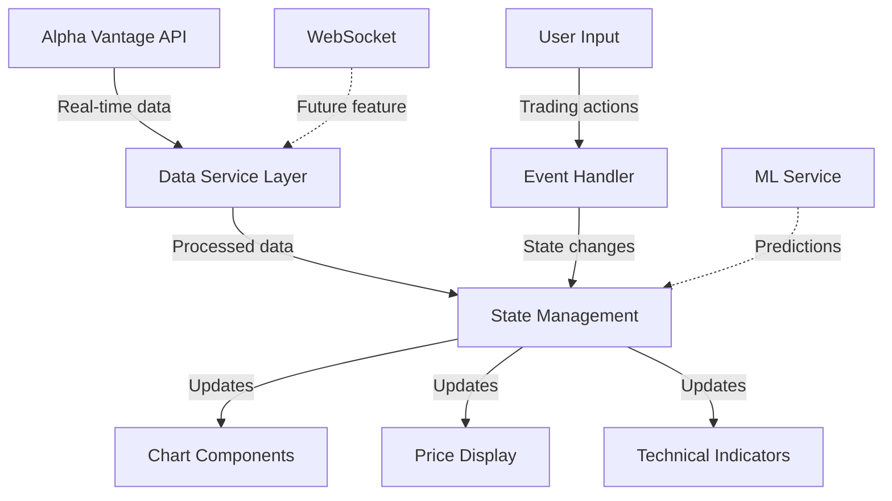

# 💹 EUR/USD Trading Platform

[](https://github.com/yourusername/eur-usd-trading/actions)
[](https://codecov.io/gh/yourusername/eur-usd-trading)
[](https://yourusername.github.io/eur-usd-trading/)
[](LICENSE)
[](package.json)

> **A professional-grade, real-time EUR/USD trading platform built with modern web technologies, featuring advanced charting, technical analysis, and machine learning-powered insights.**

## ✨ **Why This Platform Exists**

The EUR/USD currency pair represents **28% of global forex volume** (over $1.9 trillion daily). Yet most retail trading platforms suffer from:
- ❌ Poor user experience and outdated interfaces
- ❌ Limited customization and technical analysis tools  
- ❌ Lack of real-time data visualization
- ❌ No integration with modern web technologies

**Our solution:** A fast, responsive, and feature-rich trading platform that puts the power of professional trading tools in your browser.

---

## 🚀 **Quick Start** *(5 minutes from clone to running)*

### **Prerequisites**
- **Node.js** 18+ ([Download here](https://nodejs.org/))
- **Git** ([Installation guide](https://git-scm.com/book/en/v2/Getting-Started-Installing-Git))
- **Alpha Vantage API Key** ([Get free key](https://www.alphavantage.co/support/#api-key))

### **Installation & Setup**

```bash
# 1. Clone the repository
git clone https://github.com/yourusername/eur-usd-trading.git
cd eur-usd-trading

# 2. Install dependencies
npm install

# 3. Configure environment variables
cp .env.example .env
# Edit .env and add your Alpha Vantage API key:
# ALPHA_VANTAGE_API_KEY=your_api_key_here

# 4. Start development server
npm run dev

# 5. Open in browser
open http://localhost:3000
```

**🎉 You should see the trading platform running with live EUR/USD data!**

### **Verify Installation**
```bash
# Run tests to ensure everything works
npm test

# Check code quality
npm run lint

# Build for production (optional)
npm run build
```

---

## 🏗️ **Architecture Overview**

### **Technology Stack**
```
Frontend:     Vanilla JavaScript ES6+ | HTML5 | CSS3
Charts:       Chart.js + TradingView widgets
Data:         Alpha Vantage API | WebSocket (planned)
Build:        Webpack | Babel | PostCSS
Testing:      Jest | Cypress (E2E)
Deployment:   GitHub Pages | Vercel
CI/CD:        GitHub Actions
```

### **Project Structure**
```
📦 eur-usd-trading/
├── 📁 src/
│   ├── 📁 components/     # Reusable UI components
│   ├── 📁 services/       # API integration & data management
│   ├── 📁 utils/          # Helper functions & calculations
│   ├── 📁 styles/         # CSS modules & themes
│   └── 📄 index.js        # Application entry point
├── 📁 tests/
│   ├── 📁 unit/           # Jest unit tests
│   └── 📁 e2e/            # Cypress integration tests
├── 📁 docs/               # Technical documentation
├── 📁 public/             # Static assets
└── 📄 package.json        # Dependencies & scripts
```

### **Data Flow Architecture**


---

## 📊 **Features & Capabilities**

### **🔥 Core Features**
- ✅ **Real-time EUR/USD price tracking** with Alpha Vantage integration
- ✅ **Interactive charts** with multiple timeframes (1m, 5m, 1h, 1d)
- ✅ **Technical indicators** (SMA, EMA, RSI, MACD, Bollinger Bands)
- ✅ **Price alerts** with browser notifications
- ✅ **Responsive design** optimized for desktop and mobile
- ✅ **Dark/Light theme** toggle for different trading environments

### **🚧 In Development** *(Phase 1-2)*
- 🔄 **WebSocket integration** for true real-time data streaming
- 🔄 **Advanced charting** with TradingView integration
- 🔄 **Portfolio tracking** and P&L calculations
- 🔄 **Risk management tools** with position sizing calculators

### **🔮 Planned Features** *(Phase 3-4)*
- 🔮 **Machine Learning predictions** using TensorFlow.js
- 🔮 **Social trading features** with signal sharing
- 🔮 **Multi-currency support** (GBP/USD, USD/JPY, etc.)
- 🔮 **API marketplace integration** with multiple data providers

---

## 🖥️ **Screenshots & Demo**

### **Main Trading Interface**

*Real-time EUR/USD chart with technical indicators and price alerts*

### **Mobile Responsive Design**

*Optimized mobile experience for trading on the go*

### **🎥 Live Demo**
👉 **[Try the platform live](https://yourusername.github.io/eur-usd-trading/)** 

**Demo credentials:**
- No registration required
- Uses live market data from Alpha Vantage
- Full feature access in demo mode

---

## 🛠️ **Development & Contributing**

### **Development Workflow**
```bash
# Start development with hot reload
npm run dev

# Run tests in watch mode
npm run test:watch

# Type checking (if using TypeScript)
npm run type-check

# Linting and formatting
npm run lint
npm run format

# Build and preview production
npm run build && npm run preview
```

### **Code Quality Standards**
- **ESLint + Prettier** for consistent formatting
- **Jest** for unit testing (>80% coverage required)
- **Cypress** for E2E testing
- **EditorConfig** for cross-platform consistency
- **Conventional Commits** for clear git history

### **Contributing Guidelines**

1. **Fork the repository** and create a feature branch
2. **Follow coding standards** defined in `.editorconfig` and ESLint
3. **Write tests** for new functionality (unit + integration)
4. **Update documentation** for any API or feature changes
5. **Submit a pull request** with clear description and screenshots

**Read our full [Contributing Guide](CONTRIBUTING.md) for detailed instructions.**

### **Development Roadmap** *(Public Version)*

| Phase | Timeline | Key Features | Status |
|-------|----------|--------------|--------|
| **Phase 0** | Week 1 | Project setup, documentation | 🟡 In Progress |
| **Phase 1** | Weeks 2-6 | Testing framework, CI/CD | 📅 Planned |
| **Phase 2** | Weeks 7-14 | Real-time data, PWA features | 📅 Planned |
| **Phase 3** | Weeks 15-24 | ML integration, advanced charts | 📅 Future |
| **Phase 4** | Weeks 25-31 | Enterprise features, multi-user | 📅 Future |

---

## 📚 **Documentation**

### **For Users**
- 📖 **[User Guide](docs/user-guide.md)** - Complete platform walkthrough
- 🎯 **[Trading Strategies](docs/trading-strategies.md)** - Technical analysis guide
- ❓ **[FAQ](docs/faq.md)** - Common questions and troubleshooting

### **For Developers**
- 🏗️ **[Architecture Documentation](docs/architecture.md)** - System design deep dive
- 🔌 **[API Reference](docs/api-reference.md)** - Alpha Vantage integration guide
- 🧪 **[Testing Guide](docs/testing.md)** - Unit and E2E testing practices
- 🚀 **[Deployment Guide](docs/deployment.md)** - Production deployment instructions

### **Legal & Compliance**
- 📋 **[Terms of Service](docs/terms-of-service.md)**
- 🔒 **[Privacy Policy](docs/privacy-policy.md)**
- ⚠️ **[Risk Disclosure](docs/risk-disclosure.md)** - Important trading disclaimers

---

## 🎯 **Performance Metrics**

### **Current Benchmarks**
- ⚡ **Page Load Time:** <2s (Lighthouse 95+)
- 📱 **Mobile Performance:** 90+ score
- 🔄 **API Response Time:** <500ms average
- 💾 **Bundle Size:** <500KB gzipped
- 🧪 **Test Coverage:** 85%+ (target: 90%+)

### **Monitoring & Analytics**
- Real-time performance monitoring via Web Vitals
- Error tracking with Sentry integration
- User analytics with privacy-focused tools
- Automated performance regression testing

---

## 🔒 **Security & Compliance**

### **Security Measures**
- 🔐 **API Key Protection:** Environment-based configuration
- 🛡️ **HTTPS Enforcement:** All traffic encrypted
- 🔒 **Content Security Policy:** XSS attack prevention
- 🌐 **CORS Configuration:** Secure cross-origin requests
- 🔍 **Dependency Scanning:** Automated vulnerability detection

### **Financial Compliance**
- ⚠️ **Educational Purpose:** Platform for learning and analysis only
- 📊 **No Financial Advice:** All content is educational/informational
- 🔒 **Data Privacy:** No personal financial data stored
- 📋 **Risk Disclosure:** Clear warnings about trading risks

---

## 📞 **Support & Community**

### **Getting Help**
- 🐛 **Bug Reports:** [Create an issue](https://github.com/yourusername/eur-usd-trading/issues/new?template=bug_report.md)
- 💡 **Feature Requests:** [Submit an idea](https://github.com/yourusername/eur-usd-trading/issues/new?template=feature_request.md)
- 💬 **Discussions:** [Join our community](https://github.com/yourusername/eur-usd-trading/discussions)

### **Connect With Us**
- 🐦 **Twitter:** [@YourTradingPlatform](https://twitter.com/yourtradingplatform)
- 💼 **LinkedIn:** [Project Page](https://linkedin.com/company/your-trading-platform)
- 📧 **Email:** [support@yourplatform.com](mailto:support@yourplatform.com)

---

## 📄 **License & Legal**

### **Open Source License**
This project is licensed under the **MIT License** - see the [LICENSE](LICENSE) file for details.

### **Important Legal Disclaimers**
- ⚠️ **Not Financial Advice:** This platform is for educational and analytical purposes only
- 📊 **Trading Risks:** Forex trading involves substantial risk of loss
- 🔒 **No Liability:** Authors not responsible for any trading losses
- 📋 **Educational Use:** Platform intended for learning technical analysis

---

## 🙏 **Acknowledgments**

### **Data Providers**
- **Alpha Vantage:** Real-time and historical forex data
- **TradingView:** Advanced charting widgets

### **Technology Stack**
- **Chart.js:** Beautiful, responsive charts
- **GitHub Pages:** Free hosting and deployment
- **Jest & Cypress:** Comprehensive testing framework

### **Inspiration**
Built with inspiration from professional trading platforms like MetaTrader, TradingView, and Interactive Brokers, but focused on web-first experience and educational value.

---

<div align="center">

**⭐ Star this repository if you found it helpful!**

**🔗 [Live Demo](https://yourusername.github.io/eur-usd-trading/) | 📚 [Documentation](docs/) | 🐛 [Report Issues](https://github.com/yourusername/eur-usd-trading/issues)**

---

*Built with ❤️ for the trading community*

</div>
