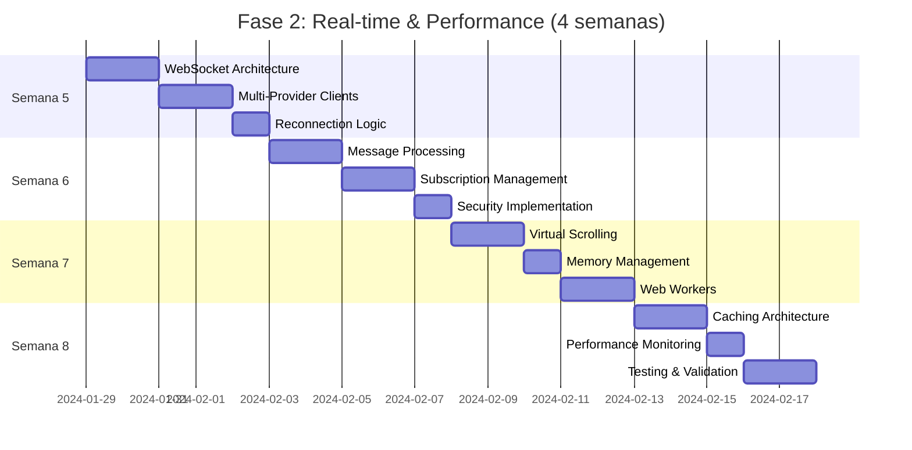

# 📋 Análisis Detallado: Fase 2 - Real-time & Performance

---

## **⚡ TAREA 1: Real-time Data Streaming Implementation**
*Duración estimada: 2 semanas*

### **Subtareas (8 items):**

**2.1.1** Diseñar WebSocket Architecture Strategy
```javascript
// Implementar connection management robusto
class WebSocketManager {
  constructor(config) {
    this.config = config;
    this.connections = new Map(); // Multi-symbol support
    this.reconnectStrategies = new Map();
    this.messageQueue = new Queue(); // Offline resilience
  }
}
```

**2.1.2** Implementar Multi-Provider WebSocket Clients
- `FinnhubWebSocketClient.js` - Primary real-time provider
- `AlphaVantageWebSocketClient.js` - Secondary provider
- `TwelveDataWebSocketClient.js` - Tertiary fallback
- Unified interface siguiendo Dependency Inversion Principle

**2.1.3** Crear Reconnection & Resilience Logic
```javascript
class ReconnectionManager {
  strategies = {
    exponentialBackoff: (attempt) => Math.min(1000 * (2 ** attempt), 30000),
    linearBackoff: (attempt) => Math.min(1000 * attempt, 15000),
    fixedInterval: () => 5000
  }
}
```

**2.1.4** Message Processing Pipeline
- `MessageValidator.js` - Schema validation de incoming data
- `MessageTransformer.js` - Normalize entre providers
- `MessageRouter.js` - Route to appropriate handlers
- Rate limiting y deduplication logic

**2.1.5** Subscription Management System
```javascript
class SubscriptionManager {
  subscribe(symbol, timeframe, callback) {
    // Dynamic subscription con cleanup automático
    // Support para multiple callbacks per symbol
    // Automatic unsubscribe cuando no hay listeners
  }
}
```

**2.1.6** Offline/Online State Handling
- Service Worker para cache de last known prices
- Queue de mensajes durante desconexiones
- Sync strategy cuando connection se restaura
- User notifications para connection status

**2.1.7** WebSocket Security Implementation
- Token-based authentication
- Message encryption para sensitive data
- Rate limiting por usuario/IP
- DDOS protection mechanisms

**2.1.8** Testing Strategy para Real-time Systems
- Mock WebSocket server para testing
- Integration tests con timeouts reales
- Load testing con multiple concurrent connections
- Network failure simulation tests

---

## **🚀 TAREA 2: Performance Optimization & Memory Management**
*Duración estimada: 1.5 semanas*

### **Subtareas (7 items):**

**2.2.1** Implement Virtual Scrolling para Large Datasets
```javascript
// Siguiendo principios de Kent C. Dodds para performance
class VirtualizedTimeSeriesChart {
  constructor(container, itemHeight, visibleBuffer = 10) {
    this.visibleItems = Math.ceil(container.height / itemHeight);
    this.startIndex = 0;
    this.endIndex = this.visibleItems + visibleBuffer;
    this.setupIntersectionObserver(); // Modern browser APIs
  }
  
  renderVisibleItems(dataPoints) {
    // Solo render items en viewport + buffer
    // Recycle DOM elements para memory efficiency
  }
}
```

**2.2.2** Memory Management Strategy
- Implementar circular buffers para price history
- Automatic garbage collection de old price data
- WeakMap usage para temporal references
- Memory leak detection en development mode

**2.2.3** Debounced & Throttled Updates
```javascript
// Aplicando principios de Dan Abramov sobre performance
const debouncedPriceUpdate = useMemo(
  () => debounce((price) => updatePriceDisplay(price), 16), // 60fps
  []
);

const throttledChartUpdate = useMemo(
  () => throttle((data) => updateChart(data), 100), // 10fps para charts
  []
);
```

**2.2.4** Web Workers para Heavy Calculations
```javascript
// Technical Analysis Worker (separar UI thread)
class TechnicalAnalysisWorker {
  constructor() {
    this.worker = new Worker('/workers/technicalAnalysis.js');
    this.setupMessageHandling();
  }
  
  calculateIndicators(priceData, indicators) {
    return new Promise((resolve) => {
      this.worker.postMessage({ priceData, indicators });
      this.worker.onmessage = (e) => resolve(e.data);
    });
  }
}
```

**2.2.5** Canvas-based Chart Rendering
- Migrar de Chart.js DOM a Canvas rendering directo
- Implement zoom/pan sin re-render completo
- Level-of-detail rendering para diferentes zoom levels
- 60fps target maintenance durante user interactions

**2.2.6** Bundle Optimization Strategy
```javascript
// Code splitting siguiendo mejores prácticas de Brian Holt
const ChartComponent = lazy(() => 
  import(/* webpackChunkName: "chart" */ './components/Chart')
);

const AdvancedAnalysis = lazy(() =>
  import(/* webpackChunkName: "analysis" */ './components/AdvancedAnalysis')
);
```

**2.2.7** Performance Monitoring Integration
- Real User Monitoring (RUM) implementation
- Core Web Vitals tracking (LCP, FID, CLS)
- Custom performance marks para trading-specific metrics
- Performance budget alerts

---

## **🗄️ TAREA 3: Smart Caching & Data Management**
*Duración estimada: 1.5 semanas*

### **Subtareas (6 items):**

**2.3.1** Multi-Level Caching Architecture
```javascript
// Siguiendo principios de Martin Fowler sobre data patterns
class CacheManager {
  constructor() {
    this.l1Cache = new Map(); // In-memory, fast access
    this.l2Cache = new IndexedDB('marketData'); // Browser persistent
    this.l3Cache = new ServiceWorker('apiCache'); // Network fallback
  }
  
  async get(key, options = {}) {
    // Try L1 -> L2 -> L3 -> Network
    // Populate upper levels on cache miss
  }
}
```

**2.3.2** Smart Cache Invalidation Strategy
- Time-based expiration (TTL) por data type
- Event-based invalidation (market open/close)
- Version-based invalidation para structural changes
- Stale-while-revalidate pattern implementation

**2.3.3** IndexedDB Implementation para Historical Data
```javascript
class HistoricalDataStore {
  constructor() {
    this.db = null;
    this.version = 1;
    this.initDB();
  }
  
  async storeCandles(symbol, timeframe, candles) {
    // Efficient storage con compression
    // Automatic cleanup de old data
    // Index optimization para fast queries
  }
}
```

**2.3.4** Service Worker para Offline Functionality
```javascript
// Progressive Web App capabilities
self.addEventListener('fetch', (event) => {
  if (event.request.url.includes('/api/market-data')) {
    event.respondWith(
      caches.match(event.request)
        .then(response => response || fetch(event.request))
    );
  }
});
```

**2.3.5** Request Deduplication System
```javascript
class RequestDeduplicator {
  constructor() {
    this.pendingRequests = new Map();
  }
  
  async makeRequest(key, requestFn) {
    if (this.pendingRequests.has(key)) {
      return this.pendingRequests.get(key);
    }
    
    const promise = requestFn();
    this.pendingRequests.set(key, promise);
    
    try {
      const result = await promise;
      return result;
    } finally {
      this.pendingRequests.delete(key);
    }
  }
}
```

**2.3.6** Cache Analytics & Optimization
- Hit/miss ratio tracking
- Cache size monitoring
- Performance impact measurement
- Automatic cache tuning basado en usage patterns

---

## **🎯 MÉTRICAS DE VALIDACIÓN (4 objetivos)**

**Métrica 1:** Real-time Latency < 50ms
- WebSocket message processing tiempo
- UI update latency measurement
- End-to-end data flow tracking
- Network latency compensation

**Métrica 2:** Memory Usage Stable Over 24h
- No memory leaks durante continuous operation
- Garbage collection efficiency monitoring
- Maximum memory usage thresholds
- Memory growth rate within acceptable limits

**Métrica 3:** 99% Uptime con Reconnection Automática
- Connection stability measurement
- Automatic recovery success rate
- Failover time between providers
- User experience continuity durante outages

**Métrica 4:** UI Responsiveness Durante High Data Volume
- Frame rate maintenance > 30fps
- User interaction response time < 100ms
- Chart performance durante zoom/pan operations
- No UI blocking durante heavy calculations

---

## **📅 CRONOGRAMA DETALLADO**



## **🚧 DEPENDENCIAS Y RIESGOS**

**Dependencias:**
- **Crítica:** Fase 1 Clean Architecture debe estar completa
- **Alta:** WebSocket provider API access (Finnhub, TwelveData)
- **Media:** Modern browser APIs support (Web Workers, IndexedDB)

**Riesgos Técnicos:**
- **Alto:** WebSocket provider rate limits más restrictivos que REST APIs
  - *Mitigación:* Multiple provider fallback + request queuing
- **Medio:** Memory leaks en long-running connections
  - *Mitigación:* Comprehensive memory profiling + automated leak detection
- **Bajo:** Browser compatibility issues con advanced APIs
  - *Mitigación:* Progressive enhancement + polyfills

**Riesgos de Performance:**
- **Alto:** Real-time updates causing UI jank
  - *Mitigación:* Web Workers + careful DOM update batching
- **Medio:** Cache size growing unbounded
  - *Mitigación:* Automatic cleanup + size monitoring

## **💡 ENTREGABLES CONCRETOS**

Al final de Fase 2 tendrás:

✅ **Sistema real-time completo** con múltiples WebSocket providers y failover automático

✅ **Performance optimizado** con virtual scrolling, Web Workers, y memory management eficiente

✅ **Caching inteligente** en múltiples niveles (memory, IndexedDB, Service Worker)

✅ **Monitoring completo** de performance metrics y user experience

✅ **Foundation robusta** para Fase 3 (Advanced Analytics & AI)

## **🔧 STACK TECNOLÓGICO ESPECÍFICO**

| Categoría | Tecnología | Propósito |
|-----------|------------|-----------|
| WebSocket Providers | Finnhub, TwelveData, Alpha Vantage | Real-time market data |
| Performance | Web Workers, Virtual Scrolling | UI responsiveness |
| Caching | IndexedDB, Service Workers | Offline capabilities |
| Monitoring | Performance Observer API | Real-time metrics |
| Testing | Jest + MSW + Playwright | E2E real-time testing |

## **🎓 PRINCIPIOS EDUCATIVOS APLICADOS**

Siguiendo la síntesis de expertise de los mejores educadores:

- **Brad Traversy's Project-Based Learning:** Cada subtarea resulta en functionality trabajando
- **Jonas Schmedtmann's Theory-Practice Integration:** Performance concepts conectados con implementation real
- **Kent C. Dodds' Testing Focus:** Testing strategy para sistemas real-time complejos
- **Martin Fowler's Evolutionary Design:** Caching architecture que evoluciona con usage patterns

**¿Listo para profundizar en alguna subtarea específica de la Fase 2, o prefieres que continúe con el desglose de la Fase 3?**