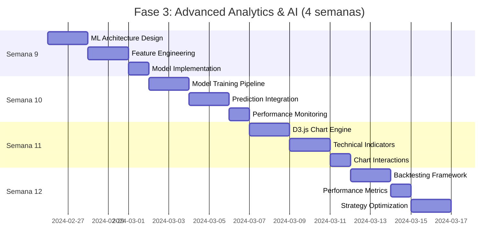

# 📋 Análisis Detallado: Fase 3 - Advanced Analytics & AI

## **📊 RESUMEN EJECUTIVO**
- **3 Tareas Principales**
- **19 Subtareas Específicas** 
- **4 Métricas de Validación**
- **Duración Total: 4 semanas**
- **Prerequisito: Fase 2 completada (Real-time system funcionando)**

---

## **🤖 TAREA 1: ML-Powered Prediction System**
*Duración estimada: 2 semanas*

### **Subtareas (8 items):**

**3.1.1** Diseñar ML Architecture siguiendo principios de Martin Kleppmann
```javascript
// Data pipeline robusto para financial ML
class TradingMLPipeline {
  constructor() {
    this.featureEngineering = new FeatureEngineer();
    this.modelManager = new ModelManager();
    this.predictionCache = new PredictionCache();
    this.performanceTracker = new ModelPerformanceTracker();
  }
  
  async processMarketData(rawData) {
    const features = await this.featureEngineering.extract(rawData);
    const predictions = await this.modelManager.predict(features);
    return this.validateAndCache(predictions);
  }
}
```

**3.1.2** Feature Engineering Implementation
```javascript
// Siguiendo principios de Ian Sommerville para systematic design
class FeatureEngineer {
  extractTechnicalFeatures(priceData) {
    return {
      // Momentum indicators
      rsi: this.calculateRSI(priceData, 14),
      macd: this.calculateMACD(priceData, 12, 26, 9),
      stochastic: this.calculateStochastic(priceData, 14),
      
      // Volatility indicators  
      atr: this.calculateATR(priceData, 14),
      bollingerBands: this.calculateBollinger(priceData, 20, 2),
      
      // Volume indicators
      volumeRatio: this.calculateVolumeRatio(priceData, 10),
      
      // Market structure
      supportResistance: this.identifyLevels(priceData),
      trendDirection: this.analyzeTrend(priceData, [5, 10, 20])
    };
  }
  
  extractMarketRegimeFeatures(data) {
    // Market session detection
    // Economic calendar impact scoring
    // Cross-asset correlation analysis
    // Volatility regime classification
  }
}
```

**3.1.3** TensorFlow.js Model Implementation
```javascript
// Aplicando Kent C. Dodds approach: testing-focused development
class EURUSDPredictor {
  constructor() {
    this.model = null;
    this.inputShape = [1, 24]; // 24 features
    this.outputClasses = 3; // bearish, neutral, bullish
  }
  
  async buildModel() {
    this.model = tf.sequential({
      layers: [
        tf.layers.dense({
          inputShape: this.inputShape.slice(1),
          units: 64,
          activation: 'relu',
          kernelRegularizer: tf.regularizers.l2({ l2: 0.01 })
        }),
        tf.layers.dropout({ rate: 0.3 }),
        tf.layers.dense({ units: 32, activation: 'relu' }),
        tf.layers.dropout({ rate: 0.2 }),
        tf.layers.dense({ 
          units: this.outputClasses, 
          activation: 'softmax' 
        })
      ]
    });
    
    this.model.compile({
      optimizer: tf.train.adam(0.001),
      loss: 'categoricalCrossentropy',
      metrics: ['accuracy']
    });
  }
  
  async train(features, labels, validationSplit = 0.2) {
    // Implement early stopping y learning rate scheduling
    const history = await this.model.fit(features, labels, {
      epochs: 100,
      validationSplit,
      callbacks: [
        tf.callbacks.earlyStopping({ patience: 10 }),
        tf.callbacks.reduceLROnPlateau({ patience: 5 })
      ]
    });
    
    return this.evaluateTraining(history);
  }
}
```

**3.1.4** Model Training Pipeline
- Historical data collection (5+ years EUR/USD)
- Data preprocessing y normalization
- Train/validation/test split con time-based validation
- Hyperparameter optimization usando Grid Search
- Cross-validation para model robustness

**3.1.5** Prediction Confidence System
```javascript
class PredictionConfidenceCalculator {
  calculateConfidence(prediction, marketContext) {
    const factors = {
      modelConfidence: prediction.probability,
      marketVolatility: this.getVolatilityAdjustment(marketContext),
      timeOfDay: this.getSessionAdjustment(marketContext.timestamp),
      newsImpact: this.getNewsImpactScore(marketContext.news),
      technicalConfluence: this.getTechnicalConfluence(marketContext.indicators)
    };
    
    return this.weightedAverage(factors);
  }
}
```

**3.1.6** Real-time Model Inference Integration
- WebWorker implementation para non-blocking predictions
- Batch processing para efficiency
- Model warmup strategies
- Error handling y fallback mechanisms

**3.1.7** Model Performance Monitoring
```javascript
// Siguiendo Martin Fowler's monitoring principles
class ModelPerformanceTracker {
  constructor() {
    this.metrics = {
      accuracy: new RollingMetric(1000), // Last 1000 predictions
      precision: new ConfusionMatrix(),
      recall: new ConfusionMatrix(),
      f1Score: new RollingMetric(1000),
      predictionLatency: new LatencyTracker()
    };
  }
  
  trackPrediction(prediction, actualOutcome, timestamp) {
    this.metrics.accuracy.add(prediction.class === actualOutcome);
    this.metrics.precision.update(prediction.class, actualOutcome);
    this.detectModelDrift(prediction, actualOutcome, timestamp);
  }
  
  detectModelDrift(prediction, actual, timestamp) {
    // Implement statistical drift detection
    // Alert cuando accuracy drops below threshold
    // Automatic model retraining triggers
  }
}
```

**3.1.8** A/B Testing Framework para Models
- Model versioning system
- Traffic splitting entre models
- Performance comparison metrics
- Automatic promotion de better-performing models

---

## **📊 TAREA 2: Advanced Charting & Visualization System**
*Duración estimada: 1.5 semanas*

### **Subtareas (6 items):**

**3.2.1** Custom D3.js Chart Engine Implementation
```javascript
// Siguiendo Sarah Drasner's visual approach to complex topics
class AdvancedTradingChart {
  constructor(container, config = {}) {
    this.svg = d3.select(container).append('svg');
    this.width = config.width || 1200;
    this.height = config.height || 600;
    this.margin = config.margin || { top: 20, right: 60, bottom: 30, left: 60 };
    
    this.xScale = d3.scaleTime();
    this.yScale = d3.scaleLinear();
    this.colorScale = d3.scaleOrdinal(d3.schemeCategory10);
    
    this.setupCanvas();
    this.indicators = new Map();
    this.overlays = new Map();
  }
  
  addIndicator(name, calculator, config = {}) {
    this.indicators.set(name, {
      calculate: calculator,
      render: config.renderer || this.defaultRenderer,
      style: config.style || {},
      yScale: config.separatePane ? d3.scaleLinear() : this.yScale
    });
  }
}
```

**3.2.2** Custom Technical Indicators Library
```javascript
// Implementar indicadores siguiendo Robert C. Martin's Clean Code principles
class TechnicalIndicators {
  // Momentum Indicators
  static rsi(prices, period = 14) {
    const gains = [];
    const losses = [];
    
    for (let i = 1; i < prices.length; i++) {
      const diff = prices[i] - prices[i - 1];
      gains.push(diff > 0 ? diff : 0);
      losses.push(diff < 0 ? Math.abs(diff) : 0);
    }
    
    return this.calculateRSI(gains, losses, period);
  }
  
  static ichimokuCloud(prices, config = { tenkan: 9, kijun: 26, senkou: 52 }) {
    return {
      tenkanSen: this.calculateTenkanSen(prices, config.tenkan),
      kijunSen: this.calculateKijunSen(prices, config.kijun),
      senkouSpanA: this.calculateSenkouSpanA(prices, config),
      senkouSpanB: this.calculateSenkouSpanB(prices, config.senkou),
      chikouSpan: this.calculateChikouSpan(prices, config.kijun)
    };
  }
  
  // Custom ML-derived indicators
  static mlTrendStrength(features, model) {
    // Use trained model para generate trend strength score
    return model.predictTrendStrength(features);
  }
}
```

**3.2.3** Interactive Chart Features Implementation
```javascript
// Siguiendo principios de Brian Holt para user experience
class ChartInteractionManager {
  constructor(chart) {
    this.chart = chart;
    this.setupZoomPan();
    this.setupCrosshair();
    this.setupDrawingTools();
    this.setupKeyboardShortcuts();
  }
  
  setupZoomPan() {
    const zoom = d3.zoom()
      .scaleExtent([0.1, 10])
      .on('zoom', (event) => {
        this.chart.updateScales(event.transform);
        this.chart.render();
      });
    
    this.chart.svg.call(zoom);
  }
  
  setupDrawingTools() {
    // Trend lines, support/resistance levels
    // Fibonacci retracements
    // Custom annotations
  }
}
```

**3.2.4** Performance-Optimized Rendering
- Canvas fallback para large datasets (>10k candles)
- Level-of-detail rendering basado en zoom level
- Virtualized rendering para off-screen elements
- 60fps maintenance durante interactions

**3.2.5** Chart Layout Management System
```javascript
class ChartLayoutManager {
  constructor() {
    this.panes = [];
    this.splitters = [];
    this.layouts = {
      single: { panes: 1, ratios: [1] },
      priceAndVolume: { panes: 2, ratios: [0.7, 0.3] },
      priceVolumeIndicators: { panes: 3, ratios: [0.6, 0.2, 0.2] }
    };
  }
  
  setLayout(layoutName) {
    const layout = this.layouts[layoutName];
    this.redistributePanes(layout.panes, layout.ratios);
    this.chart.resize();
  }
}
```

**3.2.6** Export & Screenshot Functionality
- SVG export para print-quality charts
- PNG/JPEG export con custom resolution
- PDF report generation con multiple charts
- Social media optimized exports

---

## **⚡ TAREA 3: Backtesting Engine Implementation**
*Duración estimada: 1.5 semanas*

### **Subtareas (5 items):**

**3.3.1** Strategy Framework Design
```javascript
// Siguiendo Gang of Four Strategy pattern
class TradingStrategy {
  constructor(name, config = {}) {
    this.name = name;
    this.config = config;
    this.signals = [];
    this.performance = new PerformanceTracker();
  }
  
  // Template method pattern
  async generateSignal(marketData, context) {
    const signal = await this.analyzeMarket(marketData, context);
    if (signal && this.validateSignal(signal, context)) {
      this.signals.push(signal);
      return signal;
    }
    return null;
  }
  
  // Abstract methods para inheritance
  analyzeMarket(data, context) {
    throw new Error('Must implement analyzeMarket method');
  }
  
  validateSignal(signal, context) {
    return this.checkRiskManagement(signal, context) &&
           this.checkTimeFilters(signal, context) &&
           this.checkMarketConditions(signal, context);
  }
}

// Example strategy implementation
class MLEnhancedStrategy extends TradingStrategy {
  constructor(mlModel, config) {
    super('ML Enhanced Strategy', config);
    this.mlModel = mlModel;
    this.technicalAnalysis = new TechnicalAnalysis();
  }
  
  async analyzeMarket(data, context) {
    const mlPrediction = await this.mlModel.predict(data);
    const technicalSignals = this.technicalAnalysis.analyze(data);
    
    return this.combineSignals(mlPrediction, technicalSignals);
  }
}
```

**3.3.2** Historical Data Management
```javascript
// Siguiendo Martin Kleppmann's data-intensive systems principles
class HistoricalDataManager {
  constructor() {
    this.storage = new IndexedDBAdapter('backtesting');
    this.compression = new DataCompression();
    this.validators = new DataValidators();
  }
  
  async loadHistoricalData(symbol, timeframe, startDate, endDate) {
    const cacheKey = `${symbol}_${timeframe}_${startDate}_${endDate}`;
    
    let data = await this.storage.get(cacheKey);
    if (!data) {
      data = await this.fetchFromAPI(symbol, timeframe, startDate, endDate);
      data = this.validators.validateAndClean(data);
      await this.storage.set(cacheKey, this.compression.compress(data));
    }
    
    return this.compression.decompress(data);
  }
  
  validateDataQuality(data) {
    // Check for gaps, outliers, inconsistencies
    // Generate data quality report
    // Suggest data cleaning actions
  }
}
```

**3.3.3** Backtesting Engine Core
```javascript
// Siguiendo Kent Beck's Test-Driven Development principles
class BacktestEngine {
  constructor(config = {}) {
    this.config = {
      initialCapital: config.initialCapital || 10000,
      commission: config.commission || 0.0001, // 1 pip for EUR/USD
      slippage: config.slippage || 0.00005, // 0.5 pip
      leverage: config.leverage || 1,
      ...config
    };
    
    this.portfolio = new Portfolio(this.config.initialCapital);
    this.orderManager = new OrderManager();
    this.riskManager = new RiskManager(config.riskSettings);
  }
  
  async runBacktest(strategy, historicalData, startDate, endDate) {
    const results = {
      trades: [],
      equity: [this.config.initialCapital],
      drawdowns: [],
      dailyReturns: [],
      metadata: { strategy: strategy.name, period: { startDate, endDate }}
    };
    
    let currentBar = 0;
    for (const dataPoint of historicalData) {
      // Update portfolio value
      this.portfolio.updateMarketValue(dataPoint);
      results.equity.push(this.portfolio.totalValue);
      
      // Generate trading signal
      const signal = await strategy.generateSignal(
        historicalData.slice(0, currentBar + 1),
        { currentBar, portfolio: this.portfolio }
      );
      
      if (signal) {
        const order = this.createOrder(signal, dataPoint);
        const execution = this.orderManager.execute(order, dataPoint);
        
        if (execution) {
          this.portfolio.addTrade(execution);
          results.trades.push(execution);
        }
      }
      
      currentBar++;
    }
    
    return this.calculateMetrics(results);
  }
}
```

**3.3.4** Performance Metrics Calculator
```javascript
class BacktestMetrics {
  static calculate(results) {
    const equity = results.equity;
    const trades = results.trades;
    
    return {
      // Return metrics
      totalReturn: this.calculateTotalReturn(equity),
      annualizedReturn: this.calculateAnnualizedReturn(equity, results.metadata.period),
      
      // Risk metrics
      sharpeRatio: this.calculateSharpeRatio(equity),
      maxDrawdown: this.calculateMaxDrawdown(equity),
      calmarRatio: this.calculateCalmarRatio(equity),
      
      // Trade metrics
      winRate: this.calculateWinRate(trades),
      profitFactor: this.calculateProfitFactor(trades),
      averageWin: this.calculateAverageWin(trades),
      averageLoss: this.calculateAverageLoss(trades),
      
      // Advanced metrics
      sortinoRatio: this.calculateSortinoRatio(equity),
      valueAtRisk: this.calculateVaR(equity, 0.05),
      expectedShortfall: this.calculateES(equity, 0.05)
    };
  }
}
```

**3.3.5** Optimization & Parameter Tuning
```javascript
// Genetic algorithm para strategy optimization
class StrategyOptimizer {
  constructor(strategy, objectiveFunction = 'sharpeRatio') {
    this.strategy = strategy;
    this.objective = objectiveFunction;
    this.generations = 50;
    this.populationSize = 100;
  }
  
  async optimize(historicalData, parameterRanges) {
    let population = this.initializePopulation(parameterRanges);
    
    for (let generation = 0; generation < this.generations; generation++) {
      const fitness = await this.evaluatePopulation(population, historicalData);
      population = this.evolvePopulation(population, fitness);
      
      console.log(`Generation ${generation}: Best fitness = ${Math.max(...fitness)}`);
    }
    
    return this.getBestParameters(population);
  }
  
  async evaluatePopulation(population, data) {
    const promises = population.map(params => 
      this.evaluateStrategy(params, data)
    );
    
    return Promise.all(promises);
  }
}
```

---

## **🎯 MÉTRICAS DE VALIDACIÓN (4 objetivos)**

**Métrica 1:** ML Prediction Accuracy > 60%
- Precision, Recall, F1-score measurement
- Out-of-sample validation performance
- Prediction confidence calibration
- Model drift detection functioning

**Métrica 2:** Backtesting Engine Performance
- Process 1M+ candles en <30 segundos
- Memory usage stable durante large backtests  
- Accurate trade execution simulation
- Statistical significance of results

**Métrica 3:** Chart Rendering Performance
- Custom indicators render en <100ms
- 60fps maintenance durante zoom/pan
- Support para 50+ simultaneous indicators
- Export functionality working correctly

**Métrica 4:** Strategy Development Workflow
- Strategy creation to backtest en <5 minutos
- Parameter optimization completable
- Results reproducible y exportable
- Integration con real-time system seamless

---

## **📅 CRONOGRAMA DETALLADO**



## **🚧 DEPENDENCIAS Y RIESGOS**

**Dependencias Técnicas:**
- **Crítica:** Fase 2 real-time data pipeline debe estar estable
- **Alta:** Sufficient historical data availability (5+ years)
- **Media:** Browser support para TensorFlow.js y Web Workers

**Riesgos de ML:**
- **Alto:** Model overfitting a historical data
  - *Mitigación:* Cross-validation + out-of-sample testing + regularization
- **Medio:** Training data quality issues
  - *Mitigación:* Comprehensive data validation + multiple data sources
- **Bajo:** Model inference latency en production
  - *Mitigación:* Model optimization + caching strategies

**Riesgos de Performance:**
- **Alto:** Backtesting engine memory consumption con large datasets
  - *Mitigación:* Streaming data processing + garbage collection optimization
- **Medio:** Chart rendering performance con multiple indicators
  - *Mitigación:* Canvas fallback + level-of-detail rendering

## **💡 ENTREGABLES CONCRETOS**

Al final de Fase 3 tendrás:

✅ **Sistema ML completo** con predicciones en tiempo real, confidence scoring, y performance monitoring

✅ **Advanced charting platform** con 20+ custom indicators, interactive features, y export capabilities

✅ **Backtesting engine robusto** con strategy framework, optimization tools, y comprehensive metrics

✅ **Integration seamless** entre ML predictions, charting, y backtesting systems

✅ **Foundation sólida** para Fase 4 (Multi-Asset & Scalability)

## **🔧 STACK TECNOLÓGICO ESPECÍFICO**

| Categoría | Tecnología | Propósito |
|-----------|------------|-----------|
| Machine Learning | TensorFlow.js, Web Workers | Client-side predictions |
| Charting | D3.js, Canvas API | Advanced visualizations |
| Data Processing | WASM (optional), Web Workers | High-performance calculations |
| Backtesting | Custom Engine, IndexedDB | Strategy testing & optimization |
| Testing | Jest, TensorFlow testing utils | ML model validation |

## **🎓 PRINCIPIOS EDUCATIVOS APLICADOS**

**Martin Kleppmann's Data Systems:** Robust data pipelines que handle financial data peculiarities
**Robert C. Martin's Clean Code:** Strategy pattern implementation que facilita extensibility
**Kent C. Dodds' Testing:** Comprehensive testing approach para ML systems reliability
**Sarah Drasner's Visual Design:** Beautiful, intuitive charting interface que makes complex data accessible

**¿Te interesa profundizar en alguna subtarea específica de la Fase 3, o continuamos con el desglose de la Fase 4: Multi-Asset & Scalability?**