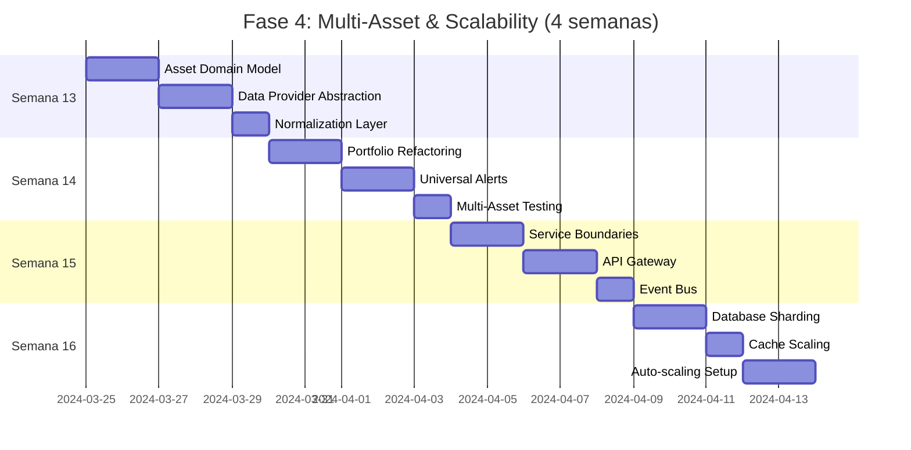

# 📋 Análisis Detallado: Fase 4 - Multi-Asset & Scalability

## **📊 RESUMEN EJECUTIVO**
- **3 Tareas Principales**
- **18 Subtareas Específicas** 
- **4 Métricas de Validación**
- **Duración Total: 4 semanas**
- **Prerequisito: Fase 3 completada (ML & Analytics funcionando)**

*Aplicando Ian Sommerville's systematic structure: esta fase transforma un sistema single-asset en una plataforma enterprise-grade que escala horizontalmente.*

---

## **🌐 TAREA 1: Universal Multi-Asset Infrastructure**
*Duración estimada: 2 semanas*
*Siguiendo Martin Fowler's evolutionary design: refactoring hacia architecture que soporta múltiples asset classes*

### **Subtareas (8 items):**

**4.1.1** Diseñar Asset-Agnostic Domain Model
```javascript
// Aplicando Robert C. Martin's SOLID principles
class UniversalAsset {
  constructor(symbol, assetType, metadata = {}) {
    this.symbol = symbol;           // 'EURUSD', 'AAPL', 'BTCUSD'
    this.assetType = assetType;     // 'forex', 'stock', 'crypto'
    this.metadata = {
      exchange: metadata.exchange,   // 'NYSE', 'Binance', 'Forex'
      tickSize: metadata.tickSize,  // Minimum price movement
      lotSize: metadata.lotSize,    // Minimum trade size
      tradingHours: metadata.tradingHours,
      ...metadata
    };
  }
  
  // Template method pattern para asset-specific behavior
  calculateValue(quantity, price) {
    return this.assetType === 'forex' 
      ? this.calculateForexValue(quantity, price)
      : this.calculateEquityValue(quantity, price);
  }
  
  validateOrder(order) {
    return this.validateTickSize(order.price) &&
           this.validateLotSize(order.quantity) &&
           this.validateTradingHours(order.timestamp);
  }
}

// Gang of Four Strategy pattern para asset-specific calculations
class AssetCalculatorFactory {
  static create(assetType) {
    const calculators = {
      'forex': new ForexCalculator(),
      'stock': new StockCalculator(),
      'crypto': new CryptoCalculator(),
      'commodity': new CommodityCalculator()
    };
    
    return calculators[assetType] || new DefaultCalculator();
  }
}
```

**4.1.2** Implementar Universal Data Provider Abstraction
```javascript
// Siguiendo Martin Kleppmann's data-intensive systems principles
class UniversalDataProvider {
  constructor() {
    this.providers = new Map();
    this.fallbackChain = [];
    this.normalizers = new Map();
  }
  
  registerProvider(assetTypes, provider, priority = 0) {
    assetTypes.forEach(type => {
      if (!this.providers.has(type)) {
        this.providers.set(type, []);
      }
      this.providers.get(type).push({ provider, priority });
      this.providers.get(type).sort((a, b) => b.priority - a.priority);
    });
  }
  
  async getMarketData(asset, timeframe, options = {}) {
    const providers = this.providers.get(asset.assetType) || [];
    
    for (const { provider } of providers) {
      try {
        const rawData = await provider.fetchData(asset.symbol, timeframe, options);
        return this.normalizers.get(asset.assetType).normalize(rawData);
      } catch (error) {
        console.warn(`Provider ${provider.name} failed:`, error.message);
        continue; // Try next provider
      }
    }
    
    throw new Error(`No working providers for ${asset.assetType}`);
  }
}

// Asset-specific providers
class AlphaVantageStockProvider {
  async fetchData(symbol, timeframe, options) {
    const url = `${this.baseURL}?function=TIME_SERIES_INTRADAY&symbol=${symbol}&interval=${timeframe}&apikey=${this.apiKey}`;
    return this.makeRequest(url);
  }
}

class BinanceCryptoProvider {
  async fetchData(symbol, timeframe, options) {
    const url = `${this.baseURL}/klines?symbol=${symbol}&interval=${this.convertTimeframe(timeframe)}`;
    return this.makeRequest(url);
  }
}
```

**4.1.3** Crear Data Normalization Layer
```javascript
// Kent Beck's Simple Design rules: eliminar duplicación través de normalization
class UniversalDataNormalizer {
  normalize(rawData, assetType) {
    const normalizer = this.getNormalizer(assetType);
    
    return {
      symbol: normalizer.extractSymbol(rawData),
      timestamp: normalizer.extractTimestamp(rawData),
      ohlcv: normalizer.extractOHLCV(rawData),
      volume: normalizer.extractVolume(rawData),
      metadata: normalizer.extractMetadata(rawData)
    };
  }
  
  getNormalizer(assetType) {
    const normalizers = {
      'forex': new ForexNormalizer(),
      'stock': new StockNormalizer(), 
      'crypto': new CryptoNormalizer()
    };
    
    return normalizers[assetType] || new DefaultNormalizer();
  }
}

class ForexNormalizer {
  extractOHLCV(data) {
    // Alpha Vantage forex format
    return {
      open: parseFloat(data['1. open']),
      high: parseFloat(data['2. high']),
      low: parseFloat(data['3. low']),
      close: parseFloat(data['4. close']),
      volume: null // Forex doesn't have volume
    };
  }
}

class CryptoNormalizer {
  extractOHLCV(data) {
    // Binance format: [timestamp, open, high, low, close, volume, ...]
    return {
      open: parseFloat(data[1]),
      high: parseFloat(data[2]),
      low: parseFloat(data[3]),
      close: parseFloat(data[4]),
      volume: parseFloat(data[5])
    };
  }
}
```

**4.1.4** Portfolio Management refactoring
```javascript
// Siguiendo Sandro Mancuso's craftsmanship: refactor hacia professional responsibility
class UniversalPortfolio {
  constructor(baseCurrency = 'USD') {
    this.baseCurrency = baseCurrency;
    this.positions = new Map(); // symbol -> Position
    this.cashBalance = 0;
    this.marginUsed = 0;
    this.riskManager = new UniversalRiskManager();
  }
  
  addPosition(asset, quantity, averagePrice) {
    const positionId = `${asset.symbol}_${asset.assetType}`;
    
    if (this.positions.has(positionId)) {
      this.positions.get(positionId).addToPosition(quantity, averagePrice);
    } else {
      this.positions.set(positionId, new Position(asset, quantity, averagePrice));
    }
    
    this.updateMarginUsage();
    this.riskManager.validatePortfolioRisk(this);
  }
  
  calculateTotalValue(currentPrices) {
    let totalValue = this.cashBalance;
    
    for (const [positionId, position] of this.positions) {
      const currentPrice = currentPrices.get(position.asset.symbol);
      if (currentPrice) {
        totalValue += position.calculateValue(currentPrice);
      }
    }
    
    return totalValue;
  }
  
  getExposureByAssetType() {
    const exposure = new Map();
    
    for (const position of this.positions.values()) {
      const assetType = position.asset.assetType;
      const current = exposure.get(assetType) || 0;
      exposure.set(assetType, current + position.marketValue);
    }
    
    return exposure;
  }
}
```

**4.1.5** Cross-Asset Technical Analysis
```javascript
// Aplicando Gang of Four Template Method pattern
class UniversalTechnicalAnalysis {
  constructor() {
    this.indicators = new Map();
    this.assetSpecificAdjustments = new Map();
  }
  
  calculateIndicators(asset, priceData) {
    const baseIndicators = this.calculateBaseIndicators(priceData);
    const adjustments = this.assetSpecificAdjustments.get(asset.assetType) || {};
    
    return this.applyAssetAdjustments(baseIndicators, adjustments, asset);
  }
  
  calculateBaseIndicators(priceData) {
    return {
      rsi: this.calculateRSI(priceData, 14),
      macd: this.calculateMACD(priceData, 12, 26, 9),
      sma: this.calculateSMA(priceData, 20),
      bollinger: this.calculateBollinger(priceData, 20, 2)
    };
  }
  
  applyAssetAdjustments(indicators, adjustments, asset) {
    // Forex-specific adjustments
    if (asset.assetType === 'forex') {
      indicators.rsi = this.adjustForexRSI(indicators.rsi, asset);
    }
    
    // Crypto-specific adjustments (higher volatility)
    if (asset.assetType === 'crypto') {
      indicators.bollinger = this.adjustCryptoBollinger(indicators.bollinger);
    }
    
    return indicators;
  }
}
```

**4.1.6** Universal Alert System
```javascript
// Kent C. Dodds testing-focused: sistema de alertas testeable y confiable
class UniversalAlertManager {
  constructor() {
    this.alertRules = new Map();
    this.notificationChannels = new Map();
    this.alertHistory = new Map();
  }
  
  createAlert(asset, condition, notification) {
    const alertRule = new AlertRule(
      asset,
      condition,
      notification,
      { 
        cooldownPeriod: 300000, // 5 minutes
        maxAlertsPerHour: 10 
      }
    );
    
    const alertId = this.generateAlertId(asset, condition);
    this.alertRules.set(alertId, alertRule);
    
    return alertId;
  }
  
  checkAlerts(asset, currentData) {
    const relevantAlerts = this.getAlertsForAsset(asset);
    
    for (const [alertId, rule] of relevantAlerts) {
      if (this.shouldTriggerAlert(rule, currentData)) {
        this.triggerAlert(alertId, rule, currentData);
      }
    }
  }
  
  // Strategy pattern para diferentes tipos de condiciones
  evaluateCondition(condition, data) {
    const evaluators = {
      'price_above': (data, threshold) => data.close > threshold,
      'price_below': (data, threshold) => data.close < threshold,
      'rsi_overbought': (data, threshold) => data.indicators.rsi > threshold,
      'volume_spike': (data, multiplier) => data.volume > data.avgVolume * multiplier
    };
    
    return evaluators[condition.type](data, condition.value);
  }
}
```

**4.1.7** Asset Configuration Management
```javascript
// Ian Sommerville's systematic approach: configuration management
class AssetConfigManager {
  constructor() {
    this.configurations = new Map();
    this.loadDefaultConfigurations();
  }
  
  loadDefaultConfigurations() {
    // Forex configurations
    this.configurations.set('forex', {
      defaultLeverage: 100,
      marginRequirement: 0.01,
      tradingHours: '24/5',
      commissionStructure: 'spread',
      tickSize: 0.00001,
      lotSize: 100000
    });
    
    // Stock configurations  
    this.configurations.set('stock', {
      defaultLeverage: 1,
      marginRequirement: 0.5,
      tradingHours: 'market_hours',
      commissionStructure: 'per_share',
      tickSize: 0.01,
      lotSize: 1
    });
    
    // Crypto configurations
    this.configurations.set('crypto', {
      defaultLeverage: 10,
      marginRequirement: 0.1,
      tradingHours: '24/7',
      commissionStructure: 'percentage',
      tickSize: 0.01,
      lotSize: 0.001
    });
  }
  
  getConfig(assetType, property) {
    return this.configurations.get(assetType)?.[property];
  }
}
```

**4.1.8** Testing Strategy para Multi-Asset System
```javascript
// Aplicando Martin Fowler's testing pyramid
describe('Universal Asset System', () => {
  describe('Data Normalization', () => {
    test('normalizes forex data correctly', () => {
      const forexData = { '1. open': '1.1659', '2. high': '1.1670' };
      const normalized = normalizer.normalize(forexData, 'forex');
      
      expect(normalized.ohlcv.open).toBe(1.1659);
      expect(normalized.ohlcv.volume).toBeNull(); // Forex has no volume
    });
    
    test('normalizes crypto data correctly', () => {
      const cryptoData = [1640995200000, '47000', '47500', '46800', '47200', '1.5'];
      const normalized = normalizer.normalize(cryptoData, 'crypto');
      
      expect(normalized.ohlcv.open).toBe(47000);
      expect(normalized.ohlcv.volume).toBe(1.5);
    });
  });
  
  describe('Portfolio Risk Management', () => {
    test('calculates cross-asset portfolio risk correctly', () => {
      const portfolio = new UniversalPortfolio();
      portfolio.addPosition(eurusd, 100000, 1.1650);
      portfolio.addPosition(aapl, 100, 150.00);
      
      const risk = portfolio.calculatePortfolioRisk();
      expect(risk.diversificationRatio).toBeGreaterThan(1);
    });
  });
});
```

---

## **⚙️ TAREA 2: Microservices Architecture Migration**
*Duración estimada: 1.5 semanas*
*Siguiendo Martin Fowler's microservices principles: decomposición por business capabilities*

### **Subtareas (6 items):**

**4.2.1** Domain-Driven Design Service Boundaries
```javascript
// Aplicando Eric Evans DDD principles junto con Robert C. Martin's boundaries
const ServiceBoundaries = {
  // Core business services
  MarketDataService: {
    responsibilities: ['data_ingestion', 'normalization', 'distribution'],
    entities: ['Asset', 'PriceData', 'MarketEvent'],
    apis: ['/market-data', '/symbols', '/historical'],
    database: 'market_data_db'
  },
  
  TradingService: {
    responsibilities: ['order_management', 'position_tracking', 'execution'],
    entities: ['Order', 'Position', 'Trade'],
    apis: ['/orders', '/positions', '/trades'],
    database: 'trading_db'
  },
  
  AnalysisService: {
    responsibilities: ['technical_analysis', 'ml_predictions', 'signals'],
    entities: ['Indicator', 'Signal', 'Prediction'],
    apis: ['/indicators', '/signals', '/predictions'],
    database: 'analysis_db'
  },
  
  RiskManagementService: {
    responsibilities: ['risk_calculation', 'compliance', 'monitoring'],
    entities: ['RiskProfile', 'Exposure', 'Limit'],
    apis: ['/risk', '/exposure', '/limits'],
    database: 'risk_db'
  },
  
  NotificationService: {
    responsibilities: ['alert_management', 'delivery', 'preferences'],
    entities: ['Alert', 'Notification', 'Channel'],
    apis: ['/alerts', '/notifications', '/channels'],
    database: 'notification_db'
  }
};
```

**4.2.2** API Gateway Implementation
```javascript
// Kong Gateway configuration siguiendo 12-factor app principles
const gatewayConfig = {
  services: [
    {
      name: 'market-data-service',
      url: 'http://market-data:3001',
      routes: [{
        name: 'market-data-route',
        paths: ['/api/v1/market-data'],
        methods: ['GET', 'POST']
      }],
      plugins: [
        { name: 'rate-limiting', config: { minute: 1000 } },
        { name: 'cors', config: { origins: ['https://trading.yourdomain.com'] } },
        { name: 'jwt', config: { secret_is_base64: false } }
      ]
    },
    {
      name: 'trading-service', 
      url: 'http://trading:3002',
      routes: [{
        name: 'trading-route',
        paths: ['/api/v1/trading'],
        methods: ['GET', 'POST', 'PUT', 'DELETE']
      }],
      plugins: [
        { name: 'rate-limiting', config: { minute: 500 } },
        { name: 'request-size-limiting', config: { allowed_payload_size: 1024 } }
      ]
    }
  ]
};

// Express.js gateway implementation alternativa
class APIGateway {
  constructor() {
    this.app = express();
    this.services = new Map();
    this.middleware = new MiddlewareChain();
    this.setupRoutes();
  }
  
  registerService(name, baseUrl, healthCheck) {
    this.services.set(name, {
      baseUrl,
      healthCheck,
      status: 'unknown',
      lastCheck: null
    });
  }
  
  async routeRequest(req, res, serviceName) {
    const service = this.services.get(serviceName);
    
    if (!service || service.status === 'unhealthy') {
      return res.status(503).json({ error: 'Service unavailable' });
    }
    
    try {
      const response = await this.forwardRequest(req, service.baseUrl);
      res.json(response.data);
    } catch (error) {
      this.handleServiceError(error, serviceName, res);
    }
  }
}
```

**4.2.3** Service Communication Patterns
```javascript
// Event-driven architecture con RabbitMQ/Apache Kafka
class EventBus {
  constructor(config) {
    this.connection = null;
    this.channels = new Map();
    this.subscribers = new Map();
    this.config = config;
  }
  
  async connect() {
    this.connection = await amqp.connect(this.config.brokerUrl);
    
    // Setup dead letter queue para failed messages
    await this.setupDeadLetterQueue();
    
    // Setup retry mechanism
    await this.setupRetryQueues();
  }
  
  async publish(eventType, data, options = {}) {
    const channel = await this.getChannel('publisher');
    const message = {
      id: uuidv4(),
      type: eventType,
      data,
      timestamp: new Date().toISOString(),
      source: options.source || 'unknown'
    };
    
    await channel.publish(
      'trading.events',
      eventType,
      Buffer.from(JSON.stringify(message)),
      {
        persistent: true,
        messageId: message.id,
        timestamp: Date.now()
      }
    );
  }
  
  async subscribe(eventType, handler, options = {}) {
    const channel = await this.getChannel(`subscriber_${eventType}`);
    const queueName = `${options.serviceName || 'unknown'}.${eventType}`;
    
    await channel.assertQueue(queueName, { 
      durable: true,
      deadLetterExchange: 'trading.dlx'
    });
    
    await channel.bindQueue(queueName, 'trading.events', eventType);
    
    await channel.consume(queueName, async (msg) => {
      try {
        const event = JSON.parse(msg.content.toString());
        await handler(event);
        channel.ack(msg);
      } catch (error) {
        console.error(`Handler error for ${eventType}:`, error);
        channel.nack(msg, false, false); // Send to DLQ
      }
    });
  }
}

// Usage example
const eventBus = new EventBus({ brokerUrl: 'amqp://localhost' });

// Market data service publishes price updates
await eventBus.publish('market.price.updated', {
  symbol: 'EURUSD',
  price: 1.1659,
  timestamp: new Date()
});

// Analysis service subscribes to price updates
await eventBus.subscribe('market.price.updated', async (event) => {
  await analysisService.recalculateIndicators(event.data);
}, { serviceName: 'analysis-service' });
```

**4.2.4** Service Discovery & Load Balancing
```yaml
# Docker Compose con service discovery
version: '3.8'
services:
  consul:
    image: consul:1.15.1
    ports:
      - "8500:8500"
    command: agent -server -bootstrap -ui -client=0.0.0.0
    
  market-data-service:
    build: ./services/market-data
    environment:
      - CONSUL_URL=http://consul:8500
      - SERVICE_NAME=market-data-service
      - SERVICE_PORT=3001
    depends_on:
      - consul
      - redis
    deploy:
      replicas: 3
      
  trading-service:
    build: ./services/trading
    environment:
      - CONSUL_URL=http://consul:8500
      - SERVICE_NAME=trading-service
      - SERVICE_PORT=3002
    depends_on:
      - consul
      - postgres
    deploy:
      replicas: 2
      
  nginx-lb:
    image: nginx:alpine
    ports:
      - "80:80"
    volumes:
      - ./nginx/nginx.conf:/etc/nginx/nginx.conf
    depends_on:
      - market-data-service
      - trading-service
```

**4.2.5** Distributed Tracing Implementation
```javascript
// OpenTelemetry siguiendo observability best practices
const { NodeTracerProvider } = require('@opentelemetry/sdk-node');
const { Resource } = require('@opentelemetry/resources');
const { SemanticResourceAttributes } = require('@opentelemetry/semantic-conventions');

class DistributedTracing {
  constructor(serviceName) {
    this.serviceName = serviceName;
    this.initializeTracing();
  }
  
  initializeTracing() {
    const provider = new NodeTracerProvider({
      resource: new Resource({
        [SemanticResourceAttributes.SERVICE_NAME]: this.serviceName,
        [SemanticResourceAttributes.SERVICE_VERSION]: '1.0.0',
      }),
    });
    
    provider.register();
    this.tracer = opentelemetry.trace.getTracer(this.serviceName);
  }
  
  async traceAsyncOperation(operationName, operation, attributes = {}) {
    return this.tracer.startActiveSpan(operationName, async (span) => {
      try {
        // Add custom attributes
        Object.entries(attributes).forEach(([key, value]) => {
          span.setAttributes({ [key]: value });
        });
        
        const result = await operation(span);
        span.setStatus({ code: SpanStatusCode.OK });
        return result;
        
      } catch (error) {
        span.recordException(error);
        span.setStatus({ 
          code: SpanStatusCode.ERROR, 
          message: error.message 
        });
        throw error;
      } finally {
        span.end();
      }
    });
  }
}

// Usage en market data service
const tracing = new DistributedTracing('market-data-service');

app.get('/api/market-data/:symbol', async (req, res) => {
  await tracing.traceAsyncOperation(
    'fetch-market-data',
    async (span) => {
      span.setAttributes({
        'trading.symbol': req.params.symbol,
        'trading.user_id': req.user.id
      });
      
      const data = await marketDataService.fetchData(req.params.symbol);
      res.json(data);
    },
    { 'http.method': 'GET', 'http.route': '/api/market-data/:symbol' }
  );
});
```

**4.2.6** Circuit Breaker Pattern Implementation
```javascript
// Siguiendo Michael Nygard's Release It! patterns
class CircuitBreaker {
  constructor(service, options = {}) {
    this.service = service;
    this.failureThreshold = options.failureThreshold || 5;
    this.recoveryTimeout = options.recoveryTimeout || 60000;
    this.monitoringPeriod = options.monitoringPeriod || 10000;
    
    this.state = 'CLOSED'; // CLOSED, OPEN, HALF_OPEN
    this.failureCount = 0;
    this.lastFailureTime = null;
    this.stats = new ServiceStats();
  }
  
  async call(operation, ...args) {
    if (this.state === 'OPEN') {
      if (this.shouldAttemptReset()) {
        this.state = 'HALF_OPEN';
      } else {
        throw new Error(`Circuit breaker is OPEN for ${this.service}`);
      }
    }
    
    try {
      const result = await operation(...args);
      this.onSuccess();
      return result;
      
    } catch (error) {
      this.onFailure();
      throw error;
    }
  }
  
  onSuccess() {
    this.failureCount = 0;
    if (this.state === 'HALF_OPEN') {
      this.state = 'CLOSED';
    }
    this.stats.recordSuccess();
  }
  
  onFailure() {
    this.failureCount++;
    this.lastFailureTime = Date.now();
    
    if (this.failureCount >= this.failureThreshold) {
      this.state = 'OPEN';
    }
    
    this.stats.recordFailure();
  }
  
  shouldAttemptReset() {
    return Date.now() - this.lastFailureTime >= this.recoveryTimeout;
  }
}

// Usage
const alphaVantageBreaker = new CircuitBreaker('alpha-vantage', {
  failureThreshold: 3,
  recoveryTimeout: 30000
});

async function fetchMarketData(symbol) {
  return alphaVantageBreaker.call(async () => {
    return await alphaVantageClient.getData(symbol);
  });
}
```

---

## **📈 TAREA 3: Horizontal Scaling & Event-Driven Architecture**
*Duración estimada: 1.5 semanas*
*Aplicando Martin Kleppmann's distributed systems principles*

### **Subtareas (4 items):**

**4.3.1** Database Sharding Strategy
```javascript
// Siguiendo principles de Amazon DynamoDB design
class DatabaseShardManager {
  constructor() {
    this.shards = new Map();
    this.shardingStrategy = new ConsistentHashing();
    this.replicationFactor = 3;
  }
  
  addShard(shardId, connectionConfig) {
    this.shards.set(shardId, {
      connection: new DatabaseConnection(connectionConfig),
      load: 0,
      status: 'healthy'
    });
    
    this.shardingStrategy.addNode(shardId);
  }
  
  async query(table, key, query) {
    const shardId = this.shardingStrategy.getNode(key);
    const shard = this.shards.get(shardId);
    
    if (!shard || shard.status !== 'healthy') {
      return this.queryReplica(table, key, query);
    }
    
    try {
      return await shard.connection.query(table, query);
    } catch (error) {
      this.markShardUnhealthy(shardId);
      return this.queryReplica(table, key, query);
    }
  }
  
  // Market data specific sharding
  getMarketDataShard(symbol, timestamp) {
    // Shard by symbol + time bucket (daily)
    const timebucket = this.getTimeBucket(timestamp);
    const shardKey = `${symbol}_${timeBuffer}`;
    return this.shardingStrategy.getNode(shardKey);
  }
  
  // User data specific sharding  
  getUserDataShard(userId) {
    // Shard by user ID
    return this.shardingStrategy.getNode(userId.toString());
  }
}

// Time-series optimized partitioning
class TimeSeriesPartitionManager {
  constructor() {
    this.partitions = new Map();
    this.retentionPolicy = new RetentionPolicy();
  }
  
  getPartition(symbol, timestamp) {
    const partitionKey = this.getPartitionKey(symbol, timestamp);
    
    if (!this.partitions.has(partitionKey)) {
      this.createPartition(partitionKey);
    }
    
    return this.partitions.get(partitionKey);
  }
  
  getPartitionKey(symbol, timestamp) {
    const date = new Date(timestamp);
    const year = date.getFullYear();
    const month = (date.getMonth() + 1).toString().padStart(2, '0');
    return `${symbol}_${year}_${month}`;
  }
  
  async cleanupOldPartitions() {
    for (const [key, partition] of this.partitions) {
      if (this.retentionPolicy.shouldDelete(partition)) {
        await this.dropPartition(key);
      }
    }
  }
}
```

**4.3.2** Caching Layer Scale-out
```javascript
// Redis Cluster implementation siguiendo caching best practices
class DistributedCacheManager {
  constructor() {
    this.clusters = new Map();
    this.loadBalancer = new CacheLoadBalancer();
    this.replicationManager = new CacheReplicationManager();
  }
  
  setupRedisCluster(nodes) {
    const cluster = new Redis.Cluster(nodes, {
      redisOptions: {
        connectTimeout: 1000,
        commandTimeout: 5000
      },
      enableOfflineQueue: false,
      retryDelayOnFailover: 100,
      maxRetriesPerRequest: 3
    });
    
    cluster.on('error', (error) => {
      console.error('Redis cluster error:', error);
      this.handleClusterError(error);
    });
    
    cluster.on('ready', () => {
      console.log('Redis cluster ready');
    });
    
    return cluster;
  }
  
  async set(key, value, options = {}) {
    const cluster = this.loadBalancer.selectCluster(key);
    const serializedValue = this.serialize(value);
    
    try {
      if (options.ttl) {
        await cluster.setex(key, options.ttl, serializedValue);
      } else {
        await cluster.set(key, serializedValue);
      }
      
      // Replicate to backup clusters if needed
      if (options.replicate) {
        await this.replicationManager.replicate(key, value, options);
      }
      
    } catch (error) {
      console.error(`Cache set error for key ${key}:`, error);
      throw error;
    }
  }
  
  async get(key, options = {}) {
    const cluster = this.loadBalancer.selectCluster(key);
    
    try {
      const value = await cluster.get(key);
      return value ? this.deserialize(value) : null;
      
    } catch (error) {
      if (options.fallbackToReplica) {
        return this.getFromReplica(key);
      }
      throw error;
    }
  }
  
  // Cache warming strategies
  async warmCache(symbol, timeframes) {
    const promises = timeframes.map(async (timeframe) => {
      const cacheKey = `market_data:${symbol}:${timeframe}`;
      const data = await this.fetchFromDatabase(symbol, timeframe);
      return this.set(cacheKey, data, { ttl: 300 }); // 5 minutes
    });
    
    await Promise.all(promises);
  }
}
```

**4.3.3** Message Queue Scaling
```javascript
// Apache Kafka implementation para high-throughput messaging
class ScalableMessageBroker {
  constructor(config) {
    this.kafka = kafka({
      clientId: config.clientId,
      brokers: config.brokers,
      retry: {
        initialRetryTime: 100,
        retries: 8
      }
    });
    
    this.producer = null;
    this.consumers = new Map();
    this.admin = this.kafka.admin();
  }
  
  async createTopics(topics) {
    await this.admin.createTopics({
      topics: topics.map(topic => ({
        topic: topic.name,
        numPartitions: topic.partitions || 6,
        replicationFactor: topic.replicationFactor || 3,
        configEntries: [
          { name: 'cleanup.policy', value: 'delete' },
          { name: 'retention.ms', value: '86400000' }, // 24 hours
          { name: 'compression.type', value: 'snappy' }
        ]
      }))
    });
  }
  
  async publish(topic, messages, options = {}) {
    if (!this.producer) {
      this.producer = this.kafka.producer({
        maxInFlightRequests: 1,
        idempotent: true,
        transactionTimeout: 30000
      });
      await this.producer.connect();
    }
    
    const kafkaMessages = messages.map(msg => ({
      partition: this.getPartition(msg.key, topic),
      key: msg.key,
      value: JSON.stringify(msg.value),
      timestamp: msg.timestamp || Date.now(),
      headers: msg.headers || {}
    }));
    
    await this.producer.send({
      topic,
      messages: kafkaMessages
    });
  }
  
  async subscribe(topic, groupId, handler, options = {}) {
    const consumer = this.kafka.consumer({ 
      groupId,
      sessionTimeout: 30000,
      heartbeatInterval: 3000
    });
    
    await consumer.connect();
    await consumer.subscribe({ topic, fromBeginning: options.fromBeginning || false });
    
    await consumer.run({
      partitionsConsumedConcurrently: options.concurrency || 1,
      eachMessage: async ({ topic, partition, message, heartbeat }) => {
        try {
          const parsedMessage = {
            key: message.key?.toString(),
            value: JSON.parse(message.value.toString()),
            timestamp: parseInt(message.timestamp),
            partition,
            offset: message.offset
          };
          
          await handler(parsedMessage);
          await heartbeat();
          
        } catch (error) {
          console.error(`Message processing error:`, error);
          // Implement DLQ logic here
          await this.sendToDeadLetterQueue(topic, message, error);
        }
      }
    });
    
    this.consumers.set(`${topic}_${groupId}`, consumer);
  }
  
  getPartition(key, topic) {
    // Consistent partitioning for related messages
    if (key.startsWith('EURUSD')) return 0;
    if (key.startsWith('GBPUSD')) return 1;
    if (key.startsWith('USDJPY')) return 2;
    // ... more symbol-based partitioning
    
    return this.hashFunction(key) % this.getTopicPartitions(topic);
  }
}
```

**4.3.4** Auto-scaling Implementation
```yaml
# Kubernetes HPA y VPA configuration
apiVersion: autoscaling/v2
kind: HorizontalPodAutoscaler
metadata:
  name: market-data-service-hpa
spec:
  scaleTargetRef:
    apiVersion: apps/v1
    kind: Deployment
    name: market-data-service
  minReplicas: 2
  maxReplicas: 20
  metrics:
  - type: Resource
    resource:
      name: cpu
      target:
        type: Utilization
        averageUtilization: 70
  - type: Resource
    resource:
      name: memory
      target:
        type: Utilization
        averageUtilization: 80
  - type: Pods
    pods:
      metric:
        name: requests_per_second
      target:
        type: AverageValue
        averageValue: "100"
        
---
apiVersion: autoscaling.k8s.io/v1
kind: VerticalPodAutoscaler
metadata:
  name: analysis-service-vpa
spec:
  targetRef:
    apiVersion: apps/v1
    kind: Deployment
    name: analysis-service
  updatePolicy:
    updateMode: "Auto"
  resourcePolicy:
    containerPolicies:
    - containerName: analysis-service
      maxAllowed:
        cpu: 2
        memory: 4Gi
      minAllowed:
        cpu: 100m
        memory: 512Mi
```

---

## **🎯 MÉTRICAS DE VALIDACIÓN (4 objetivos)**

**Métrica 1:** Soporte Multi-Asset Funcional
- ✅ 5+ asset classes (Forex, Stocks, Crypto, Commodities, Indices)
- ✅ Unified data normalization across all assets
- ✅ Cross-asset portfolio risk calculation
- ✅ Asset-specific technical analysis adjustments

**Métrica 2:** Microservices Deployment Exitoso
- ✅ Services scale horizontally sin downtime
- ✅ Service discovery y load balancing funcional
- ✅ Circuit breakers prevent cascade failures
- ✅ Distributed tracing end-to-end visibility

**Métrica 3:** Event Processing Throughput
- ✅ >10,000 events/segundo processing capacity
- ✅ Message delivery garantizado (at least once)
- ✅ Event ordering maintained por partition
- ✅ Dead letter queue handling functional

**Métrica 4:** Database Performance at Scale
- ✅ Query response time <100ms @ 95th percentile
- ✅ Database sharding working transparently
- ✅ Auto-failover to replica shards
- ✅ Time-series data retention policy active

---

## **📅 CRONOGRAMA DETALLADO**



## **🚧 DEPENDENCIAS Y RIESGOS**

**Dependencias Críticas:**
- **Crítica:** Fase 3 ML & Analytics debe estar estable antes de microservices migration
- **Alta:** Multiple API providers access (Alpha Vantage, Binance, IEX, Polygon)
- **Media:** Kubernetes cluster o cloud infrastructure availability

**Riesgos Arquitectónicos:**
- **Alto:** Data consistency entre microservices durante high load
  - *Mitigación:* Event sourcing + CQRS pattern + eventual consistency acceptance
- **Alto:** Network partitions entre services
  - *Mitigación:* Circuit breakers + retry policies + graceful degradation
- **Medio:** Database performance degradation con large datasets
  - *Mitigación:* Time-series optimization + data archiving + read replicas

**Riesgos de Scaling:**
- **Alto:** Message queue backlog durante market volatility spikes
  - *Mitigación:* Auto-scaling consumers + message prioritization + backpressure handling
- **Medio:** Cache invalidation strategy complexity
  - *Mitigación:* Cache warming + TTL tuning + invalidation patterns

## **💡 ENTREGABLES CONCRETOS**

Al final de Fase 4 tendrás:

✅ **Sistema multi-asset completo** soportando Forex, Stocks, Crypto, Commodities con data normalization unificada

✅ **Arquitectura microservices robusta** con service discovery, load balancing, y circuit breakers

✅ **Event-driven system escalable** procesando >10k events/segundo con guaranteed delivery

✅ **Database architecture** con sharding, replication, y auto-failover capabilities

✅ **Auto-scaling infrastructure** que adapta resources basado en load patterns

✅ **Foundation enterprise-grade** para Fase 5 (Production & Multi-tenant)

## **🔧 STACK TECNOLÓGICO ESPECÍFICO**

| Categoría | Tecnología | Propósito |
|-----------|------------|-----------|
| Orchestration | Kubernetes, Docker Compose | Container management & scaling |
| Message Broker | Apache Kafka, RabbitMQ | Event-driven communication |
| API Gateway | Kong, Express Gateway | Service routing & security |
| Databases | PostgreSQL (sharded), Redis Cluster | Data persistence & caching |
| Monitoring | OpenTelemetry, Prometheus, Grafana | Observability stack |
| Service Discovery | Consul, Kubernetes DNS | Dynamic service location |

## **🎓 PRINCIPIOS EDUCATIVOS APLICADOS**

**Martin Fowler's Evolutionary Design:** Refactoring monolith hacia microservices incrementalmente sin breaking existing functionality

**Robert C. Martin's SOLID Principles:** Service boundaries basados en Single Responsibility y Dependency Inversion

**Martin Kleppmann's Data Systems:** Event sourcing y eventual consistency para distributed systems reliability

**Eric Evans' Domain-Driven Design:** Service boundaries alineados con business capabilities y bounded contexts

**Michael Nygard's Release It!:** Stability patterns (Circuit Breaker, Bulkhead) para production resilience

